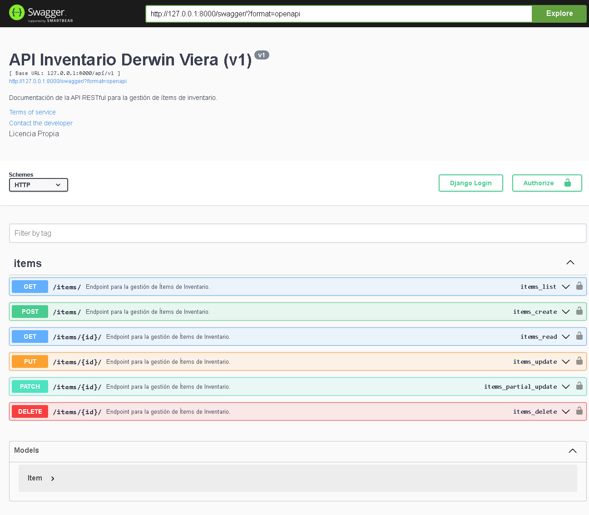
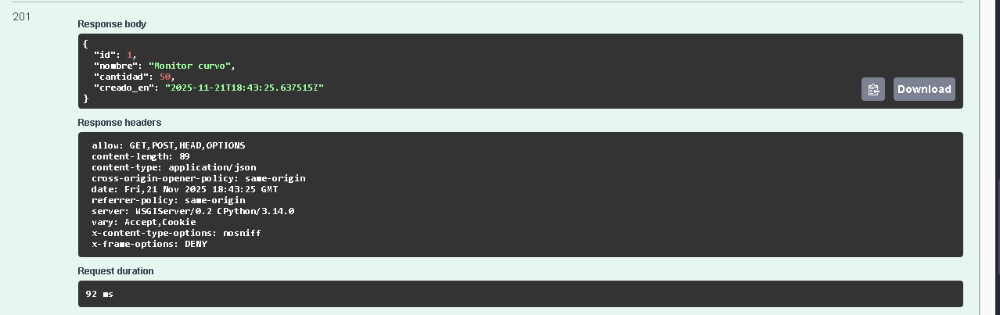

# Documentacion de API 
# Proyecto API RESTful - Documentación para Derwin Viera

Este proyecto implementa una API RESTful de Inventario documentada automáticamente con Swagger (drf-yasg).

## Documentación de la API
* **URL de Documentación Interactiva:** http://127.0.0.1:8000/swagger/

### Vista General de Endpoints
Se muestra la lista completa de endpoints generados a partir del ViewSet:

 

### Esquemas y Descripciones
Detalle del esquema de respuesta (código 201), incluyendo los metadatos de documentación (descripciones, tipos y restricciones de los campos):

### Prueba de Navegabilidad
Prueba de ejecución del método POST que resultó en un código 201 Created, demostrando que la API funciona desde la documentación:

